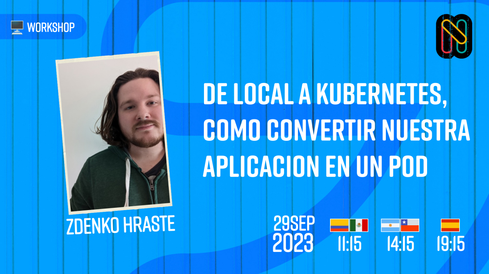

<!-- .slide: data-background="https://github.com/sysarmy/2023.nerdear.la/blob/main/app/static/img/hero-background.jpeg?raw=true" data-background-transition="zoom" -->

# Intro a GitOps con Flux {style=color:white;font-style:italic}

<h4 style="color:white;font-family:Roboto">
Marco Richetta

Nerdearla 2023

</h4>

---

<!-- .slide: data-timing=90 data-background-transition="zoom" -->

## About me

::: .container

::: left

-   Las Perdices, Córdoba 🇦🇷
-   Aprendiendo de software desde 2016
-   Haciendo cosas @ Mercado Libre
-   [marcorichetta.dev](https://www.marcorichetta.dev/)

:::

::: right

{height=600, style="border:0"}

:::

:::

---

<!-- .slide: data-timing=60 -->

## Agenda

1. Intro
1. GitOps
1. Flux
1. Demo
1. Recap

note: En esta charla vamos a ver qué es GitOps,
por qué surge y que ventajas trae.
Seguido de eso les voy a contar sobre Flux, un set de herramientas para implementar GitOps.
Finalmente haremos una demo para ver su funcionamiento paso a paso.

---

<!-- .slide: data-timing=120 -->

## Objetivo

1. Que conozcan de que va gitops
2. Que aprendan sobre flux
3. Que lo puedan probar localmente

--

## A quién va dirigida?

-   Usas `kubectl apply` desde tu compu o CI
-   Querés automatizar deploys de apps/infra
-   Buscas una alternativa/complemento a Terraform
-   **Nerds**, obvio

--

::: container
::: left

:::
::: middle

:::

:::

{width=600}

---

<!-- .slide: data-timing=180 -->

# YA\*Ops

(Yet Another \*Ops)

--

{height=900}
{height=300}{.fragment}
{.r-stack}

note: No nos dejemos llevar por _the new kid on the block_.
Para mí, lo valioso de estas metodologías es la variedad.
Al igual que con nuevas tecnologías, tenemos que saber adaptarlas a nuestro uso.
Al final todo termina siendo `ClickOps`

--

 {.r-stretch}

---

<!-- .slide: data-timing=45 -->

# GitOps

note:
Es un modelo de trabajo basado en Git como **source of truth.**  
Git no solo para código de apps 
sino también para crear, modificar y eliminar recursos. 
Es una forma de implementar Infra as Data

--

---

### Timeline

<!-- .slide: data-timing=180 -->

{width=1200}

note:
2017 - _GitOps_ es acuñado por primera vez por Alexis Richardson 
2018 - Empieza a ganar tracción. 
Referentes hablan 
Cloud providers importantes lo adoptan 
También se crea ArgoCD 
2019 - Flux es aceptado en la CNCF Sandbox 
2020 - CNCF adoption de Flux 
1st GitOpsDays conf 
2021 - 1st GitOpsCon 
Se crea OpenGitOps para acelerar la adopción 
2022 - Flux y ArgoCD se graduan

--

note: 10 MINUTOS

---

{width=2600px}

note:
1.Definís tu sistema en archivos → Reproducibilidad  (Bootstrap nuevos recursos con _copy & paste)_
Sabes qué es lo que está desplegado 
2.Los beneficios de Git aplicados a cualquier recurso 
(PRs flows, Static checkers) 
Auditabilidad - Todos los cambios son observables, verificables y auditables 
3.Como el estado declarado se almacena en Git, se pueden automatizar todos los cambios que a implementarse a través de un PR. 
Rollback? se puede revertir un PR y listo.
 
4.El sistema es **monitoreado** constantemente y cuenta con **self-healing** en caso de cualquier cambio o fallo. Se busca asegurar que lo que deployamos coincide con lo declarado en el repositorio.

---

{width=1200, style="border:none";}

> Flux is a set of continuous and progressive delivery solutions for Kubernetes

--

## Features

::: .container

::: left

**Git push y Flux se encarga del resto**

:::

::: middle

**Flux 🤝 Tools**

<ul>
<li><b>Git providers</b>: Github, Gitlab, Bitbucket, hasta S3!</li>
<li><b>Container registries</b></li>
<li><b>K8s:</b>: Kustomize, Helm, RBAC</li>
</ul>

:::

::: right

**Monitoreo**

<ul>
<li><b>Health checks</b></li>
<li><b>Alertas</b>: Grafana, Datadog</li>
<li><b>Notificaciones</b>: Github, Slack, Discord</li>
</ul>

:::

:::

--

## Controllers

En Kubernetes, los Controllers ejecutan _control loops_ que observan el **estado del cluster** y solicitan o ejecutan cambios según se necesite, con el objetivo de llegar al **estado deseado.**

note: Ej: termostato

--

### Arquitectura

{width=1200}

note:
Source: Sincroniza los sources (Git, Bucket, S3) y los guarda como artefactos para ser utilizados por otros ctrls. 
Kustomize: Genera, valida y aplica los manifiestos en el cluster. 
Helm: Manejo de Helm Releases y Charts. 
Notification: 
Notifica a nuestro sistema de eventos externos (Github, Gitlab, Docker) 
Notifica a sistemas externos (Slack, Discord, Teams) de nuestros eventos 
Image Reflector: Escanea repos de imagenes (Docker, OCI) y guarda la image metadata para ser usada por el **Automation Controller** 👇 
Automation: Actualiza archivos YAML (`git commit`) cuando nuevas imagenes están disponibles. ⇒ **Kustomize Controller** nota el cambio y empieza a sincronizar 

--

# Push vs Pull Based Deployments

--

## Push

-   Approach tradicional (GH Actions, Gitlab CI, Jenkins)
-   Deployment Pipeline contiene credenciales (⚠️ God mode ⚠️)
-   No detecta desvíos entre el Environment Repo vs Environment

--

## Pull

-   _Deployment Pipeline_ => _Operator_
-   Encargado de observar y comparar continuamente el **estado deseado** vs el **estado actual**

-   Permisos sync con k8s (RBAC)

-   Además monitorea el _Image Registry_ para encontrar nuevas versiones de imágenes

note:
Cuando el `Environment` cambie de cualquier manera que no esté descrita en nuestro `Environment Repository`, **estos cambios serán revertidos**.  
Asegura que **todos los cambios en nuestro `Environment` deben pasar por git**  
También se puede sincronizar manualmente 🙌

---

<!-- .slide: data-background="https://media.giphy.com/media/v1.Y2lkPTc5MGI3NjExcW41Y3Q0M3k1NjN5YWl2bDNvc2Jxam8wN2VsNTY0ODhjanNnNTdzdiZlcD12MV9pbnRlcm5hbF9naWZfYnlfaWQmY3Q9Zw/99RUx0EF2fmCsFmiLj/giphy.gif" data-background-size=800px -->

--

### Si quieren seguirme...

{width=500, style=border:0}

---

# Recap

#### GitOps

-   Git como Source of Truth
-

#### Flux

Una forma de hacer GitOps en K8s

--

## Ecosistema

::: container

::: left

:::

::: rigth

:::

:::
