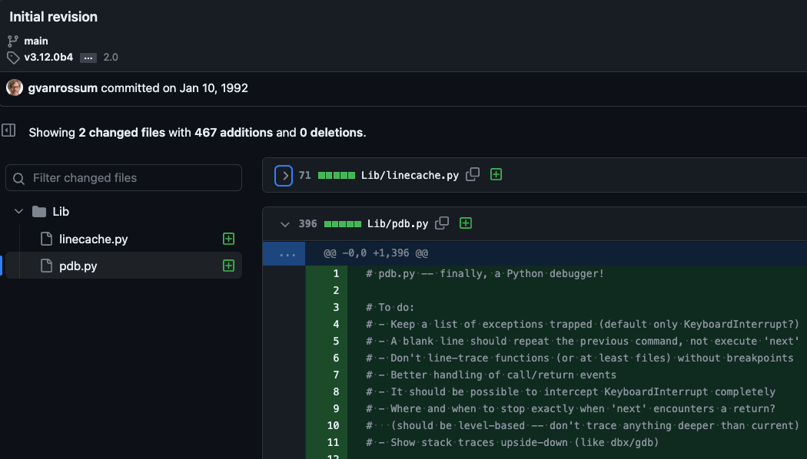
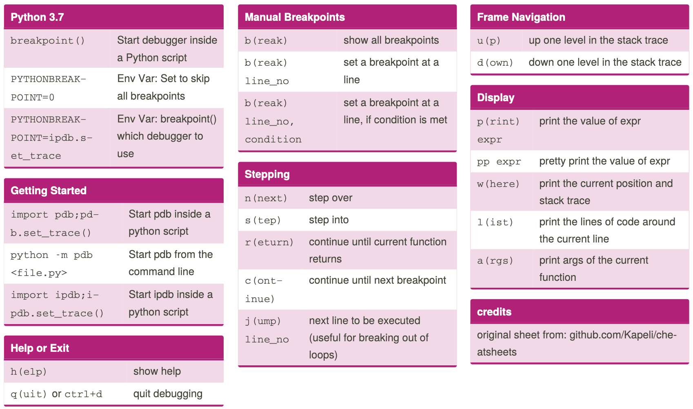

# Pdb

<small>o como encontrar errores sin print()</small>

---

## Dr Who?

-   Córdoba 🇦🇷
-   Code Eco - https://furydocs.io/code-eco/1.3.17/guide/
-   Trabajando en mejorar la DX de Python
    -   Python
    -   Poetry
    -   and beyond ?)

---

## Agenda

1. Debugging, why?
2. pdb
3. Demo 🔥
4. Recap
5. Recursos extra

note: primero un poco de historia,
despues vemos las features de pdb y
por ultimo una demo de como usar esto localmente, con apps web o hasta en un lab
En esta charla veremos qué es `pdb`, qué funcionalidades nos brinda y como usarlo en nuestro día a día, tanto desde
un IDLE, una terminal hasta utilizándolo mediante la GUI de VSCode. También veremos como usarlo en nuestros tests

---

### Por qué hablamos de _"Debugging"_?

note: Qué tiene que ver un insecto con un error de computación?
En parte se lo debemos a Grace Hopper y su equipo.

--


--


_Bug_ capturado en la Harvard Mark II, Septiembre 1947

note: Documentaron en 1947 el primer bug (literal) atrapado en una computadora

--


ENIAC, una de las primeras computadoras de propósito general

--

<!-- .slide: data-background-iframe="https://www.youtube.com/embed/tpIctyqH29Q" -->

---

## Python Debugger



Introducido en 1992 ([2 años después de Python](https://github.com/python/cpython/commit/921c82401b6053ae7dacad5ef9a4bd02bdf8dbf1#diff-98d47941a1bfadcfdfe02973122c83be2940ca6f3b1c32ca8898e7f594d2669d))

--

### Funcionalidades

-   Controlar la ejecución de tu programa
    -   Inspeccionar variables
    -   Ejecutar expresiones
    -   Explorar el código

```python
# Python +3.7
breakpoint()

# O
import pdb; pdb.set_trace()
```

--

### Comandos más comunes

-   `p variable` - inspecciona una variable
-   `l(ist)` - Muestra el código del archivo
-   `c(ontinue)` - Continúa la ejecución hasta el próximo breakpoint
-   `n(ext)` - Continúa la ejecución hasta la siguiente línea
-   `s(tep)` - Más granular que `n`
-   `h(elp)` - Muestra los comandos disponibles

---

## Demo time 🔥

---

## Tricks

#### Podes deshabilitar los breakpoints en tu código

```python
PYTHONBREAKPOINT=0 python demo.py
```

#### Pero trata de no dejarlos 🚧

`debug-statements` pre-commit hook

-   Chequea debugger statements en tu código

-   [Pystack](https://github.com/bloomberg/pystack) - Inspeccionar procesos de Python en ejecución o Python core dumps para entender qué están haciendo

---

## Recap

-   Debugging
-   Como usar pdb
-   Comandos más comunes
-   pdb, ipdb, vscode, tests + pdb

--

Cheatsheet


https://www.nnja.io/2019/python-debugging-cheatsheet.pdf
