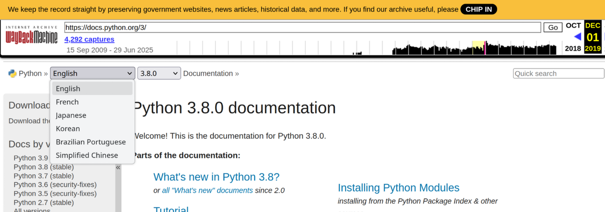
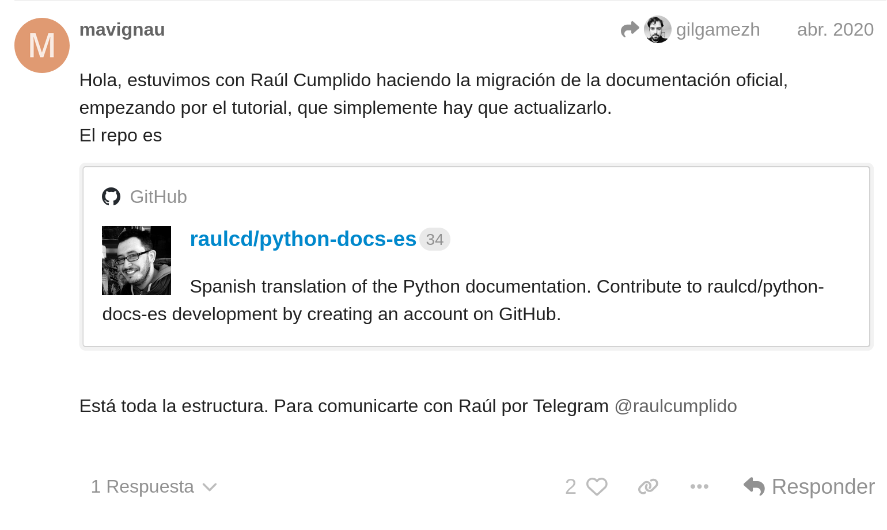
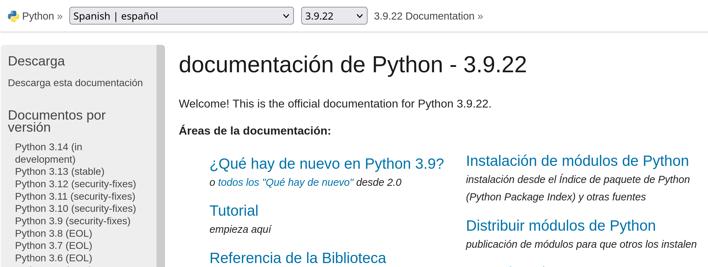
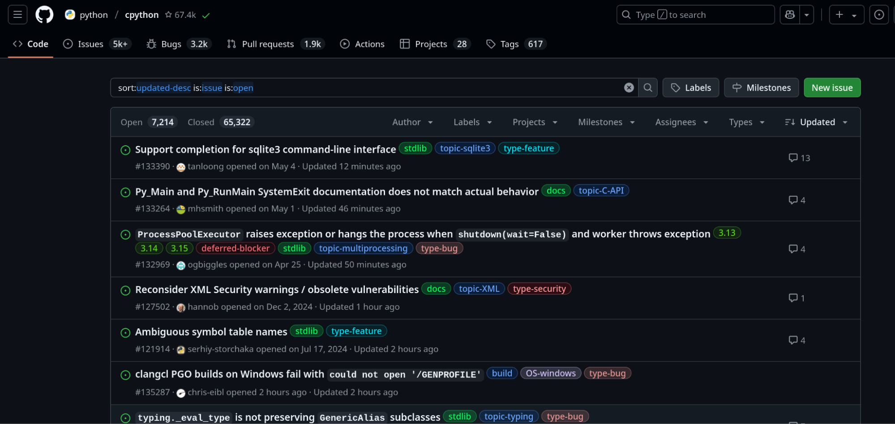
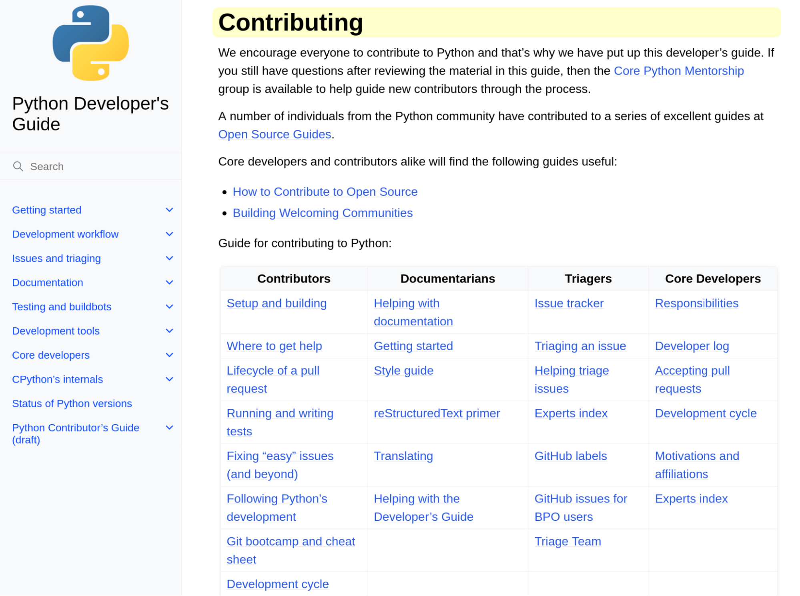

# How to Contribute to the Python Community in Your Own Language

### Translating Python Documentation to Spanish: Experiences and Learnings

  
    Marco Richetta
  

<!--
Welcome Everyone! 👋
I'm Marco, and I'm here to talk about how to **contribute to Python in your own language**.

Thanks to EuroPython organizers and volunteers for their help. It’s my first time here and I’m really amazed at the conference size!
-->

---
layout: image-right
image: /assets/about.webp
---

## About Me

<v-clicks>

- Córdoba 🇦🇷 
- Living in Copenhagen 🇩🇰
- Making the world a better place™ with software since ~2016
- I like to play bass and I'm a dog owner (I miss you so much Lola 🐶)

</v-clicks>

<!--
-->

---

## How many of you do not speak English natively? 🖐️

<!--
Just to check if you are awake
How many...
Could you raise your hand?

Ok, I think this is gonna be more valuable to you.
-->

---

## Goals

<v-clicks>

1.  Make you aware of this project and the **importance of translation**.
2.  Inspire you to **contribute to existing initiatives** (🇵🇹 🇵🇱 🇹🇷 🇰🇷).
3.  Promote it in **your own language**! (🇨🇿?)

</v-clicks>

<!--
I have **three goals** for this talk

<3 clicks>

If at least one person feels inspired to contribute to the community, I will feel accomplished!
-->

---

## Agenda

<v-clicks>

### 1.  **Why translate?**
### 2.  **Py-Docs-ES story 🇪🇸**
### 3.  **What you can do?**

</v-clicks>

<!--
- I’m here to tell you about our journey with the Python translation to Spanish.
- And for that, the agenda will cover
- First why I think it's important to translate the documentation.
- Then I will tell you about our story, how we started, and what we have achieved
- Finally, I will tell you what you can do to start contributing
-->

---

## Why Translate?

<!--
- Documentation is crucial for the development and growth of any project. 
- If you know English, you're lucky; most of the knowledge is in that language. But what about people who don't? 😢

We had translation services before
Nowadays it's even easier with LLMs, which I'm gonna mention later in the talk because... 
# AI
-->

---
layout: quote
---

# The Importance of reading in our mother tongue 🏡

 

## <i>"Having the docs in our language means people can feel like home."</i>

<!--
I want to paraphrase Cristián Maureira, who is also part of the project

Read phrase

I think you can relate to this feeling, specially if you live abroad and see something in your native language.

It grabs your attention immediately.
-->

---

## Important because of other reasons

<v-clicks>

- **New Users**: The official tutorial provide a structured path to learn Python.
- **Educators and Newcomers**: Programming is being taught at an increasingly younger age.
- **Contribute to open source**: Lowers the barriers to entry.
- **Other Contributors**: Find more adequate terms in other languages.

</v-clicks>

<!--
This is also important because of other reasons:

<v-clicks>

- **New Python Users**: The tutorials provide a structured path to learn Python.
- **Educators and Newcomers**: Programming is being taught at an increasingly younger age. Being able to teach Python to young people in their native language is a big plus.
- **Contributing to Open Source**: It's a great way to get started in open source.
- **Other Contributors**: I took a lot of inspiration from the 🇵🇹 translation
</v-clicks>
-->

---

## Our Story: Python-Docs-ES 🇪🇸

---
transition: slide-up
---

## Back in the day

### <i>Honorable mention to the Wayback Machine</i>

<!--
- the official docs didn't offer a Spanish option
- This is a snapshot of it in December 2019.
- People who didn't have good English had to rely on translation services or community blogs
- Which are fine most of the time, but not always
-->

---
transition: slide-up
---

# **2019**:

- Marian Vignau 🇦🇷 assisted Pycon US
- Finds out Raúl Cumplido 🇪🇸 was working on the 🇪🇸 translation.
- Inspired by the 🇫🇷 translation

## Standing on the shoulders of giants

<!--
- Marian Vignau 🇦🇷 assisted Pycon US
- In a lunch, she finds out Raúl Cumplido 🇪🇸 was working on the 🇪🇸 translation.
- Inspired by the 🇫🇷 translation
-->

---
transition: slide-up
---

# **April 2020**

Vinicius Ferreira 🇧🇷 talked about the 🇵🇹 translation in Python Pizza Remote.

<!-- 
Then Vinicius Ferreira 🇧🇷

Which led to other 🇪🇸 listeners to do the same.
-->

---
transition: slide-up
---

<!-- The magic of the Internet happened -->

---
transition: slide-up
---

  

<!--
and made interested people find each other and join efforts.

This is a screenshot of Marian Vignau telling about the project they had already started
-->

---
transition: slide-up
---

# **May 1st 2020**

<v-clicks depth="2">

- First meeting!
- COVID was making people do all kinds of weird things
- some of us decided to translate the Python docs to Spanish
    - (which is not a weird thing)

</v-clicks>

---
transition: slide-up
---

# **June 2020**

`https://docs.python.org/es` was a reality! 🚀

  

---

# Some numbers

- **4317** commits
- **350** files translated (> 75%)
- **+300** contributors (and counting)

---

# Our Process

(Show diagram here)

1. Configure your fork
1. Request a file to translate
1. Translate it on your computer
1. Push and create the pull request
1. Wait for feedback
1. Success 🎉

---

# Ask for help 🫂

## Guide with the required step-by-step configuration:
`https://python-docs-es.readthedocs.io/es/3.13/CONTRIBUTING.html`

## Telegram channel:
`https://t.me/python_docs_es`

---
layout: two-cols
---

## What Can You Do?

Contributing to Python doesn’t have to be scary!

::right::

---

## What About LLMs? 🤖

What role do LLMs play in this? We cannot ignore that they're pretty useful in translation.
Professional translators are in the same situation as us. They know that AI will get better and better (99%), and that offers for that 1% you can provide will become scarce.
(Mention Gally.net | AI and Translation)

---

## Closing Thoughts 💭

My 2 cents:

- Do it for the **community**, you never know the people you get to know when helping others.
- **Learn**: You will learn about Python and how to work collaboratively.
- It’s not only translation; it's a great opportunity to get started on **open source**.
- **Contribute to open source**: It's adding a tiny grain of sand to a collective effort that has been going on for years and will continue beyond us.

---

# Be part of something bigger than you

---
layout: image-right
image: /assets/qr_telegram.jpg
---

# Translate to a New Language?

### Let's have a talk! 😀

`https://t.me/python_docs_es`

---
layout: image
image: https://media.giphy.com/media/KJ1f5iTl4Oo7u/giphy.gif
---
